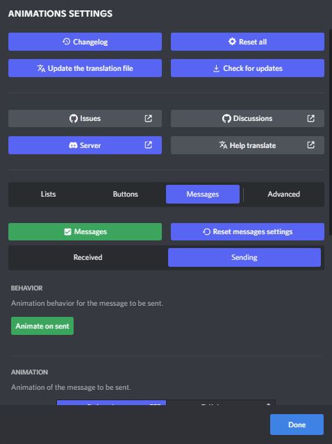

## About
This plugin is designed to animate different objects (lists, buttons, panels, etc.) with the ability to set delays, durations, types and directions of these animations.

## Updates
You can download the latest version ***AT YOUR OWN RISK [here](https://downgit.evecalm.com/#/home?url=https://github.com/Mopsgamer/BetterDiscord-codes/tree/main/plugins/Animations/Animations.plugin.js) (downgit)***.

